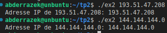
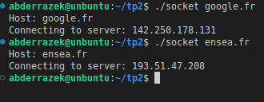
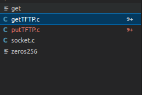
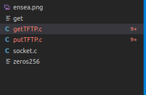
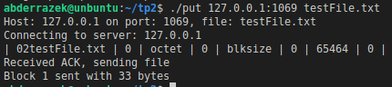

*Réaliser un client TFTP, à l’aide des RFC et de captures wireshark*

**Protocole TFTP (Trivial File Transfer Protocol)**

Le TFTP est un protocole de transfert de fichiers simple, exempt d'exigences d'authentification, adapté aux applications ne nécessitant pas les fonctionnalités avancées du protocole FTP.

**1. Utilisation de getaddrinfo pour Obtenir l'Adresse du Serveur**

Le code de cette section, situé dans le fichier "ex2.c", crée un programme simple. En prenant le nom du serveur en argument, il utilise la fonction getaddrinfo() pour obtenir l'adresse IP correspondante. Cette fonction est essentielle pour obtenir des informations d'adresse associées à un nom d'hôte ou une adresse IP donnés, permettant ainsi la résolution du nom du serveur en une adresse IP utilisable.

**3. Réservation d’un socket de connexion vers le serveur**

Dans cette partie nous avons établi une connexion de socket à un serveur à une adresse spécifiée en utilisant la fonction getaddrinfo().

**4. Gettftp :**

Dans cette étape, nous avons initié le processus en créant la fonction gettftp, conçue pour rechercher un document sur le serveur et créer une copie de celui-ci dans notre répertoire local. Pour commencer, nous avons importé le serveur dans notre machine virtuelle, suivi du lancement de l'objet ./go.sh.

En conformité avec les spécifications du protocole TFTP, nous avons élaboré un paquet RRQ (Read Request) conforme au format requis. Par la suite, ce paquet a été transmis au serveur en utilisant la fonction sendto.

Notre programme s'engage dans la réception du fichier, encapsulé dans un seul bloc de données (DAT), tout en gérant simultanément l'envoi d'accusés de réception (ACK). Le contenu du fichier reçu est extrait et sauvegardé localement. En conclusion de cette étape, un accusé de réception (ACK) est renvoyé au serveur, et les fichiers sont désormais présents dans notre répertoire local.

                   

**4. PutTFTP :**

**Construction d’une requête en écriture (WRQ) et envoi au serveur :**

`   `- La fonction putFile construit une requête en écriture (WRQ) correctement formée, comprenant le nom du fichier, le mode ("octet"), et la taille du bloc. Cette requête est ensuite envoyée au serveur via sendto.

**Envoi d’un fichier en paquets de données (DAT) et réception des acquittements (ACK) :**

`   `- La fonction envoie le fichier en plusieurs paquets de données (DAT) au serveur, et elle attend les acquittements correspondants (ACK). Ceci est réalisé dans une boucle while (1).

**Gestion de l'envoi continu de paquets de données et vérification des acquittements :**

`   `- La boucle while (1) dans la fonction putFile gère l'envoi continu de paquets de données jusqu'à ce que tout le fichier soit transféré. Une vérification commentée (/\*|| blockId != blockCounter\*/) pour correspondre aux acquittements attendus est présente dans le code.

